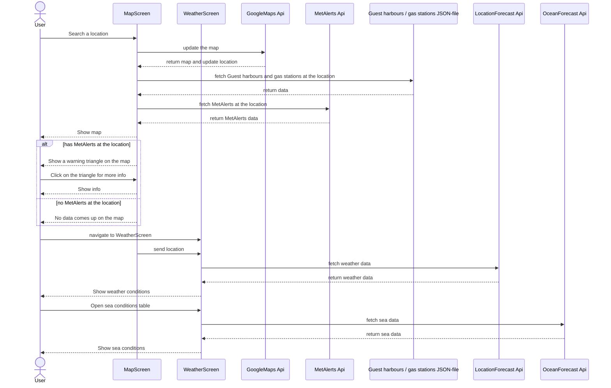
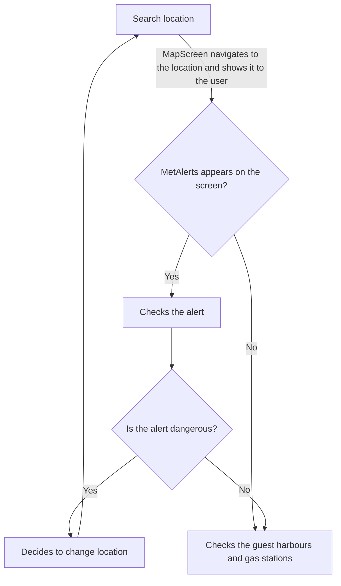

# **Modeling**

We began our application development journey by hosting a meeting to determine what kind of application we wanted to create and identify our target audience. Once we had a clear understanding of these factors, we conducted a survey via Facebook groups for boat drivers. The purpose of this survey was to gather feedback from representatives of our target audience, in order to determine the most desired functions for our application.

Now we will present the results of the survey in the form of user stories **(“As a [role], I want [function] in order to achieve [benefit]”)**, showcasing functions requested by our potential users, ranged from the most popular to the least.

1. As a boat driver, I want a weather alert feature that notifies me about high wind conditions, ensuring my safety while on the water.
2. As a boat driver, I want the ability to access guest parking information in order to easily find and utilize available parking spots.
3. As a boat driver, I want a feature that displays nearby gas stations so that I can easily locate and refuel my boat when needed.
4. As a boat driver, I want to be able to check the water temperature at different locations in order to plan and enjoy swimming activities.
5. As a boat driver, I want to receive alerts regarding waves and their intensity, helping me make decisions about current conditions and potential risks.

## **Use case diagram**

To illustrate the interaction between our application and the environment, we will use a Use Case diagram. We define the user as the primary actor. The user's goal in interacting with the system is to be able to check the data defined in user stories (weather and meteorological alerts in the area they are interested in). We have decided to implement these functions through the following pattern:
There are two screens in the application. On the main screen users see a map.
As an overlay on the map users can see markers for guest parking and gas stations. It is also possible to click on the markers to see additional information.
Users can check the area they need by navigating on the map.
If there are any meteorological alerts in the area a user navigated to, they come up to the screen in form of a warning triangle in the top right corner on the map. The user can click on it for additional information.
After navigating to the area the user can check the weather and sea conditions by navigating to the weather-screen.

### Precondition

The user opens the application and the main screen (map) is loaded, showing Oslo and the Oslofjord as a hard coded start position. We assume that internet connection is available, and no errors occur when the user works with the application. 
The user wants to plan a boat trip and uses the application to check the weather and sea conditions in the area he wants to travel to.

### **Main flow**:

1. The user searches for the location he is interested in to check available guest harbours and gas stations there.
2. No meteorological alerts appear on the map for the new area.
3. The user clicks on different guest harbors to check available facilities there.
4. The user navigates to the weather screen to check the weather and sea conditions.

### **Alternative flow 1, step 2**
* 2.1 There are meteorological alerts in the new area. A triangle appears on the map indicating meteorological alerts. The user clicks on the warning triangle for more information.
* 2.2 The alerts are quite dangerous, so the user decides to change his destination point (goes back to step 1).

### **Alternative flow 2, step 2.2**
* 2.2.1 The alerts are not dangerous, so the user continue planing of his trip (goes to the step 3).

For the application to function, and for the user to be able to perform these actions, we need to fetch different data from MET´s Api (weather forecast, ocean forecast, meteorological alerts) and Google (map), which means they are secondary actors in our system.

* **Primary actor**: User
* **Secondary actors**: Google, MET

## Sequence diagram

After creating a Use Case diagram to depict the interaction between our application and the environment, we want to demonstrate the information flow within the application using a Sequence diagram. As the Sequence diagram provides a more deep view compared to the Use Case diagram, we need to define additional participants within the system to show the flow:
* **Actor**: User
* **participant**: MapScreen - main screen 
* **participant**: WeatherScreen
* **participant**: GoogleMaps Api - we get the map from the Api
* **participant**: MetAlerts Api - we get data about meteorological from the Api
* **participant**: Guest harbours / gas stations JSON-file - The most important function requested by our potential users was the ability to access information on guest harbors and gas stations. Since we could not find any suitable free API with this data, we made the decision to generate our own temporary solution by creating a JSON file containing the desired information. We acknowledge that this data source does not offer optimal scalability, we want to emphasize that it is only a temporary measure.
* **participant**: LocationForecast Api - we get weather conditions data
* **participant**: OceanForecast Api - we get sea conditions data

## Activity diagram

As a final stage of modeling we want to make an activity diagram to illustrate the flow of events in the use case and to show the interaction with the application from the user's point of view. It will help us to depict the sequence of activities, actions, and decisions that occur during the execution of the use case described over.

